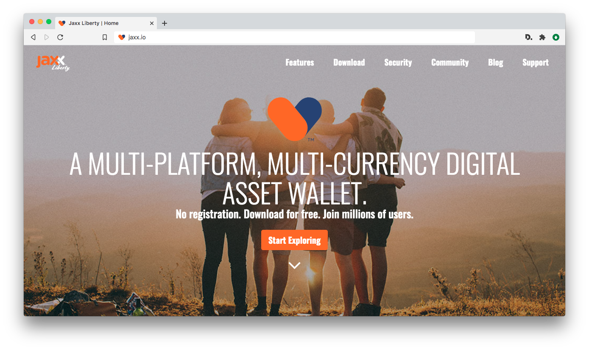

# Jaxx Revolutions: Jaxx Liberty V1 Production Website

Repo for the original version 1.0 of jaxx.io, the official website of Jaxx Liberty, a cryptocurrency wallet app made by Decentral Inc. This version was the most unique in terms of animation, typography, and layout. It includes a banner timeline animation using GSAP and Vivus.js for svg logo stroke animation, parallax animation with rellax.js, and scroll animation susing scroll magic & GSAP. UI/UX design, visual design and image asset creation, and coding/development by Andrew Mason.

For more information see [jaxx.io](https://jaxx.io) and [decentral.ca](https://decentral.ca).

## **Layout and Frameworks**

The site uses Bootstrap 4.1. Layout uses native Bootstrap classes, flexbox, and functional css.

## **CSS**

1. Functional [Atomic] css: the site employs the atomic css approach where small, single purpose classes are used based on visual function. Classes are referenced once in the CSS then used repeatedly in the HTML so as to avoid class repetition in the stylesheet.

*Note: the HTML can get heavy with classes specifically when it comes to spacing (padding and margin styles). Effort has been made to keep styles 'functional' as much as possible, with added stylesheet classes only when necessary.*

2. One stylesheet is used with an effort at organizing structure vertically based on relationship to HTML and page order. Starts with resets and global elements, proceeding to more specific styles.

3. Animate.css is used throughout the site, largely for carousel animations and page transition effects.

4. Naming conventions: 

    - titles and headings: `site-title`, `page-title`, `section-title`, `section-sub-title`
    - fonts: custom hosted font is used (UniNeue): individual styles are made into classes (text-light | text-reg | text-book (not used) text-heavy | text-bold)
    - background images: `bg-img-...`
    - background colors: `bg-...`
    - logos and icons: `jaxx-logo` and `jaxx-icon`

## **JS**

**Multiple JS plugins are used on the site.**

1. Animisation: a jquery plugin that adds css transition effects on page changes/reload. Data-attrributes are embedded in HTML with css effects (largely based on animate.css).
    - atrributes are added to <a> links, as well as a main content tag. These allow the addition of transition effects to be applied whenever a link is clicked, and additionally when a page loads. Different effects are added on each menu (and footer) link.

2. Scroll Magic: adds effects that are activated based on scroll position.

3. GSAP (GreenSock): Tweening and timeline animation in combination with Scroll Magic.

4. Rellax.js: A Parallax plugin allowing for muliple layering of parallax elements.
    - a `rellax` class is added to hmtl tags in addition to js init and options

5. Vivus.js: a js library that animates svg shapes/images, particularly svg stroke, giving the illusion of "drawing" a word. I used it to animate the 'Jaxx Liberty' logo in the opening banner animation timeline.  